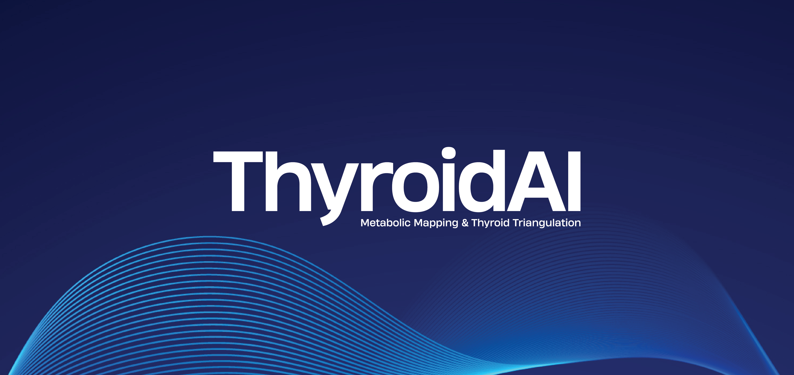
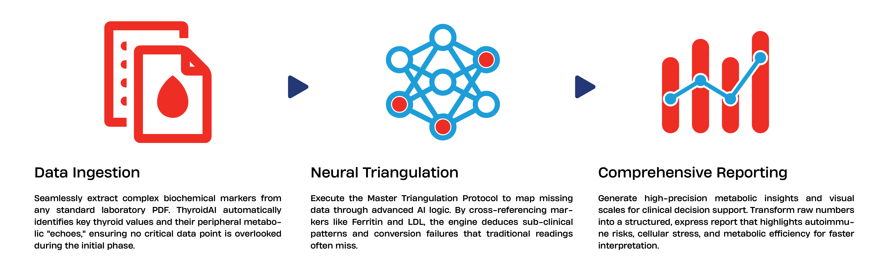
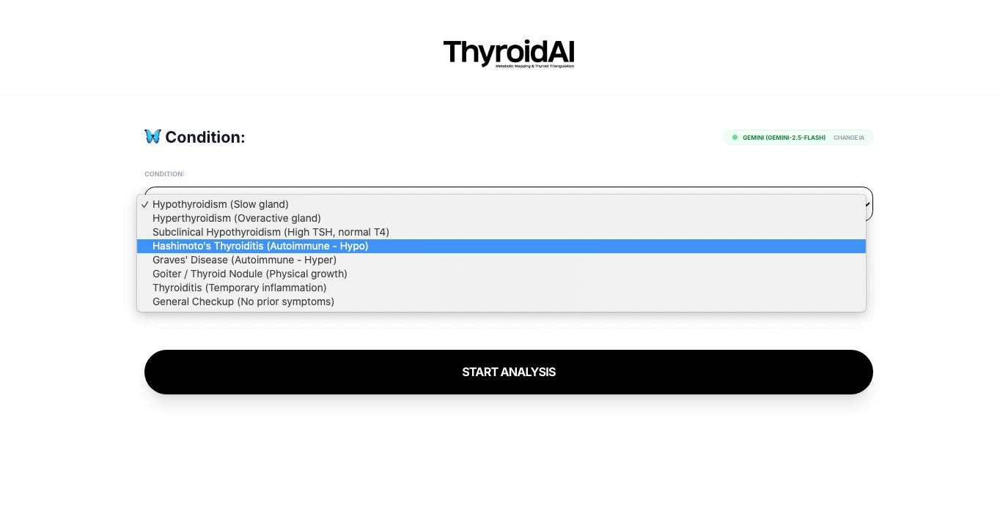

# ThyroidAI




[](https://creativecommons.org/licenses/by-nc/4.0/) [](https://www.npmjs.com/package/cthmodules) [](https://github.com/your-user/thyroid-ai)

⚠️ **While ThyroidAI is a powerful metabolic triangulation system, it is intended solely as an educational and interpretive support tool. It is not a substitute for professional medical diagnosis or treatment. Always consult with a healthcare professional regarding any medical decisions.**

---

```bash
🚧 Beta version: Active development and testing phase.
```

**ThyroidAI** is an advanced metabolic analysis tool powered by Artificial Intelligence, designed to interpret laboratory reports (PDF) with a focus on thyroid health. It utilizes a **Master Triangulation Protocol** to deduce hormonal markers even when they are missing from the blood test, based on the patient's general biochemistry.

## ✨ Features

* 🔬 **Metabolic Triangulation (v2.1):** Expert analysis of thyroid axis and conversion ratios ($FT3/FT4$, $FT3/rT3$).
* 💊 **Pharmacological Engine:** Evaluates how thyroid medications (T4, T3, NDT) impact laboratory results.
* 🤖 **Universal AI Support:** Native integration with OpenAI, Anthropic, Gemini, xAI, and local Ollama.
* 🌍 **Global Reach:** Full multilingual interface and processing in 20 different languages.
* 📋 **Smart Extraction:** High-fidelity PDF parsing to convert lab reports into structured clinical data.
* 📈 **Batch Processing:** Ability to analyze multiple files simultaneously for research or cohort studies.
* 🦋 **Clinical Context:** Analysis logic tailored to specific conditions like Hashimoto's or Graves'.
* 🛡️ **Academic License:** Data persistence via JSON and non-commercial scientific licensing (CC BY-NC).

---


**ThyroidAI** is not just a document reader; it is a **biochemical triangulation engine**. Its primary function is to solve the "missing pieces" problem in conventional blood tests.

```bash
main.js
```

### Versatility and Intent
This tool was designed to build more versatile and accessible systems for generating **express thyroid reports**. By leveraging triangulation calculations, it allows practitioners and users to obtain a high-precision metabolic snapshot in seconds, even when faced with incomplete lab data. It bridges the gap between raw data and clinical insight, making complex functional analysis fast, scalable, and easy to interpret.

When a specific marker has not been requested by the doctor, the tool uses a **metabolic "rule of three"** to map the probability of imbalance based on the "echo" that hormones leave in other bodily systems.

### Triangulation Mechanisms Table (Data Mapping)

| Target Marker | If data is missing, check (Support 1) | Hypothesis Reinforcement (Support 2) | Rule of Three Logic |
| :--- | :--- | :--- | :--- |
| **Free T3 (Activity)** | High LDL Cholesterol | Low Ferritin (< 60 ng/mL) | Without iron and with high LDL, T3 cannot enter the cell or is not produced efficiently. |
| **TSH (Central Signal)** | Elevated CPK + Low Sodium | High Uric Acid | Hypothyroidism slows purine clearance and affects the sodium-potassium pump. |
| **T4 (Supply)** | High Total Cholesterol | Low Alkaline Phosphatase | Low zinc and vitamin A levels (detected via ALP) suggest poor T4 production. |
| **rT3 (Block/Stress)** | High CRP & Homocysteine | GGT & Total Bilirubin > 1.0 | A congested and inflamed liver diverts T4 toward Reverse T3 (metabolic brake). |
| **Antibodies (Autoimm.)** | Vit. D < 30 + B12 < 400 | Lymphocytes > 40% | Immune dysregulation due to key vitamin deficiencies often precedes Anti-TPO elevation. |
| **TBG (Transport)** | Albumin > 4.8 g/dL | High Total Proteins | Excessive transport proteins "kidnap" free hormones, even if "Total" levels look normal. |

---

### 🌐 ThyroidAI Web App

In addition to the core processing logic, this repository features a fully interactive **Web App** designed for a seamless, visual user experience. This interface allows users to upload laboratory PDF reports directly from the browser, choose from over 20 languages, and connect with various AI providers (OpenAI, Anthropic, Gemini, Grok, or Ollama) through a personalized setup. The App automatically manages the "Master Protocol" for metabolic analysis and generates a detailed results dashboard, enabling anyone to perform advanced thyroid assessments without writing a single line of code.

```bash
index.html
```

---

## 🛠️ Installation

1.  Clone this repository:
    ```bash
    git clone git clone https://github.com/alejomalia/thyroidAI.git
    cd thyroidAI
    ```

2.  Install the required dependencies:
    ```bash
    npm install fs path chalk enquirer pdf-parse
    ```

## 🚀 Usage

Launch the application with the following command:

```bash
node main.js  # Main engine
node thyroidai-cli.js  # Verify language, AI connectivity and protocol logic
```

## ⚖️ License and Academic Purpose
[](https://creativecommons.org/licenses/by-nc/4.0/)

This project is committed to **Open Science** and the advancement of medical education. To ensure it remains a resource for the global research community and to prevent unauthorized commercial exploitation, it is licensed under the **CC BY-NC 4.0**.

📝 Key Terms:
- **Academic & Scientific Use:** You are encouraged to share, adapt, and build upon this material for educational and research purposes.

- **Non-Commercial:** This tool and its derivatives cannot be used for commercial purposes or financial gain without explicit permission.

- **Attribution:** You must give appropriate credit to the original author (Alejo Malia) and provide a link to the license.

